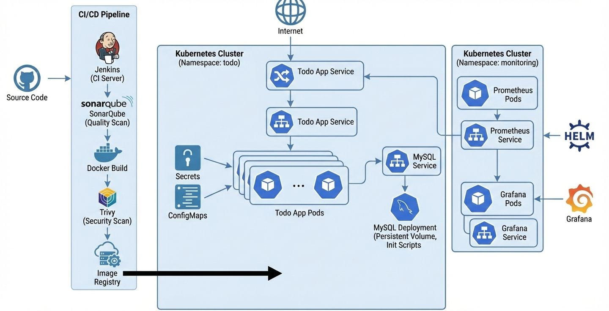

# Todo Application – Kubernetes CI/CD Architecture

## 📌 Project Overview

This project demonstrates a **production-style Kubernetes deployment** of a Todo web application with:

- CI/CD pipeline using Jenkins
- Code quality and security scanning
- Containerized application deployment
- MySQL database with persistent storage
- Configuration management using Secrets and ConfigMaps
- Monitoring using Prometheus and Grafana

The architecture and implementation strictly follow the provided system diagram.

---

## 🏗️ High-Level Architecture (As per Diagram)

The system is divided into **three logical parts**:

1. **CI/CD Pipeline**
2. **Application Kubernetes Cluster (Namespace: `todo`)**
3. **Monitoring Kubernetes Cluster (Namespace: `monitoring`)**

---

## 1️⃣ CI/CD Pipeline

### Components

- **Source Code Repository**
- **Jenkins (CI Server)**
- **SonarQube**
- **Docker**
- **Trivy**
- **Container Image Registry**

### Flow

1. Developer pushes code to the source repository.
2. Jenkins pipeline is triggered.
3. Jenkins runs:
   - **SonarQube scan** for code quality.
   - **Docker build** to create application image.
   - **Trivy scan** for container image vulnerabilities.
4. On successful scans, the Docker image is pushed to the **Image Registry**.
5. Kubernetes cluster pulls the image for deployment.

---

## 2️⃣ Kubernetes Cluster – Application Layer

**Namespace:** `todo`

### Deployed Components

#### ✅ Todo Application

- **Todo App Pods**
  - Multiple replicas for high availability
  - Stateless application containers

- **Todo App Service**
  - Exposes the application internally within the cluster
  - Acts as a stable endpoint for pods

#### ✅ Configuration Management

- **Secrets**
  - Database credentials
  - Application secret keys

- **ConfigMaps**
  - Application and database initialization configuration

#### ✅ Database Layer

- **MySQL Deployment**
  - Runs as a dedicated database pod

- **Persistent Volume**
  - Ensures database data persists across pod restarts

- **Init Scripts**
  - Used for initial database schema and setup

- **MySQL Service**
  - Provides internal access to the database for the Todo app

### Application Flow

1. Incoming requests reach the **Todo App Service**.
2. Requests are routed to one of the **Todo App Pods**.
3. Application reads configuration from **Secrets** and **ConfigMaps**.
4. Application communicates with **MySQL Service**.
5. MySQL persists data in the **Persistent Volume**.

---

## 3️⃣ Kubernetes Cluster – Monitoring Layer

**Namespace:** `monitoring`

### Components

#### 📊 Prometheus

- **Prometheus Pods**
  - Collect metrics from Kubernetes and application services

- **Prometheus Service**
  - Exposes Prometheus internally

- Installed and managed using **Helm**

#### 📈 Grafana

- **Grafana Pods**
  - Visualize metrics collected by Prometheus

- **Grafana Service**
  - Provides access to dashboards

### Monitoring Flow

1. Prometheus scrapes metrics from application services.
2. Metrics are stored inside Prometheus.
3. Grafana queries Prometheus as a data source.
4. Users view dashboards and system health via Grafana UI.

---

## 🔐 Security & Quality (As Shown in Diagram)

- **SonarQube**
  - Static code analysis
  - Code quality gates

- **Trivy**
  - Container image vulnerability scanning

- **Secrets & ConfigMaps**
  - No hardcoded credentials
  - Separation of configuration and code

---

## 🚀 Deployment Summary

| Layer            | Technology                |
|------------------|---------------------------|
| CI/CD            | Jenkins, SonarQube, Trivy |
| Containerization | Docker                    |
| Orchestration    | Kubernetes                |
| Database         | MySQL                     |
| Configuration    | Secrets, ConfigMaps       |
| Monitoring       | Prometheus, Grafana       |
| Package Manager  | Helm                      |

